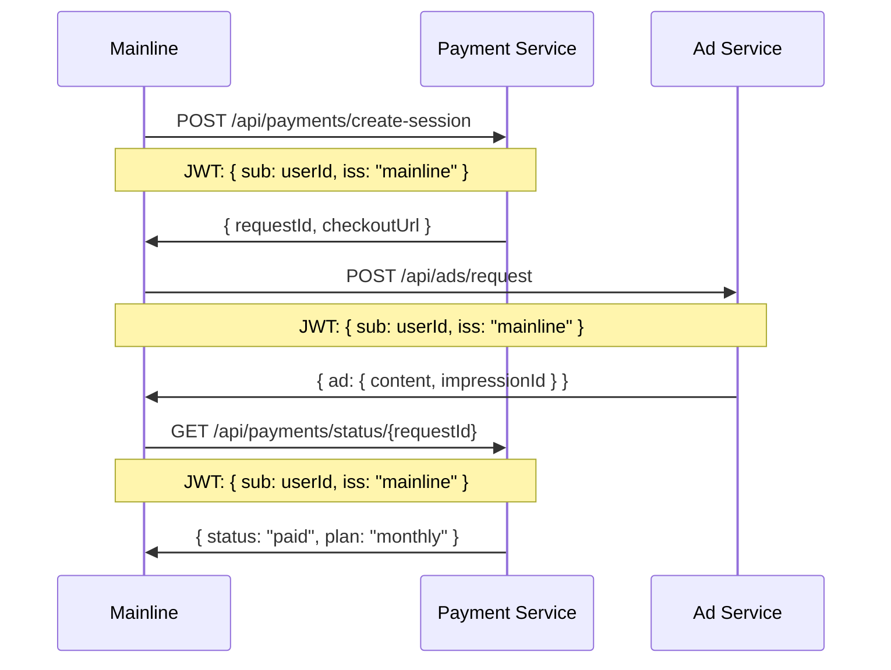
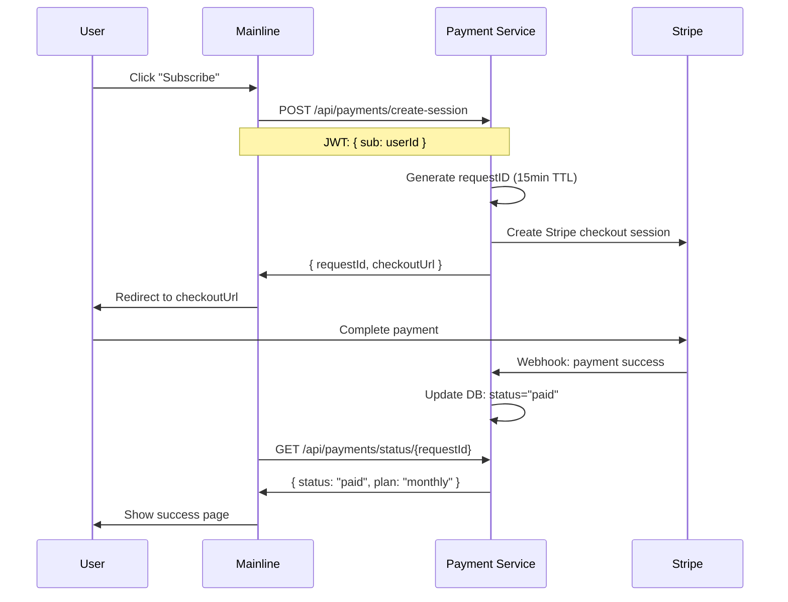
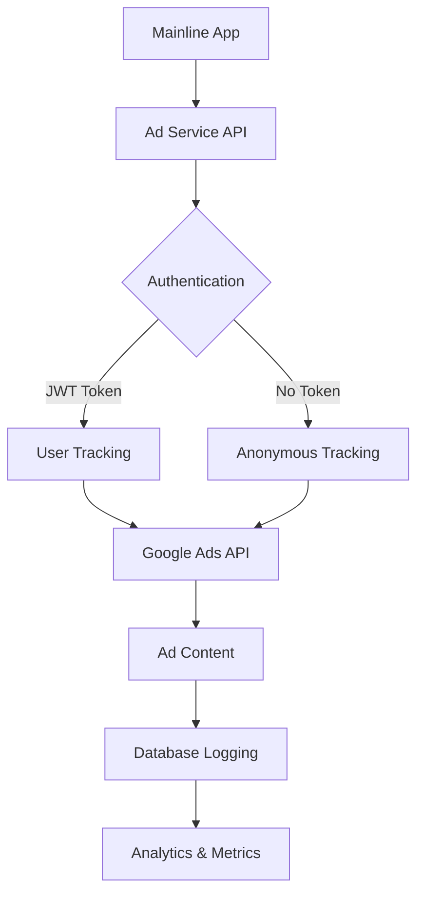
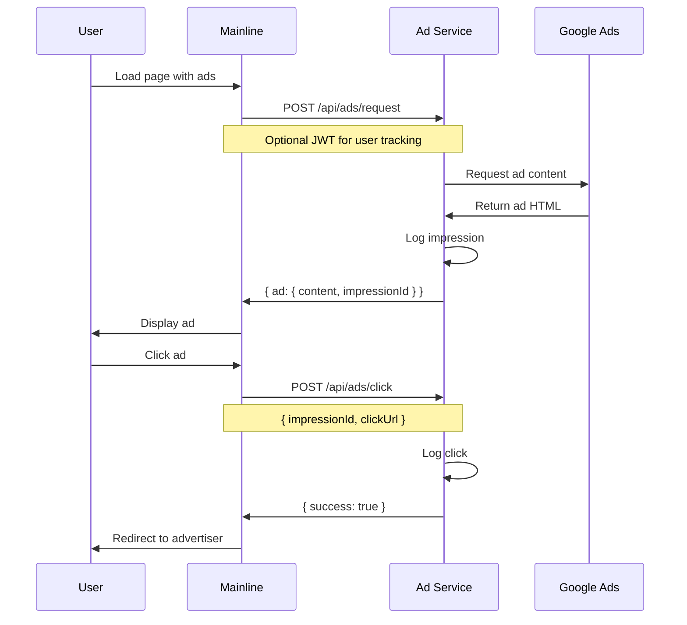
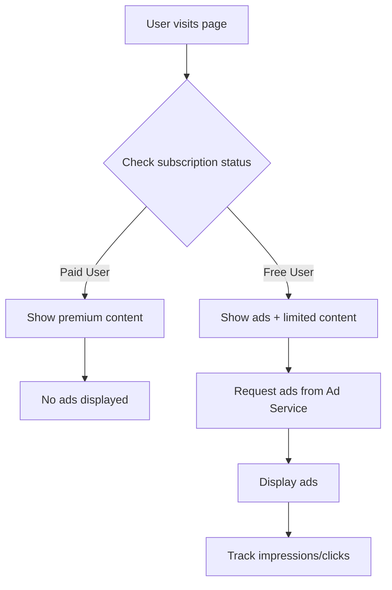

# ClassGuru Payment & Ad Services Integration Guide

**Complete integration documentation for ClassGuru microservices ecosystem**

This document provides comprehensive integration guidelines for the ClassGuru Payment Service and Ad Service, ensuring seamless communication and unified user experience across the platform.

---

## 🏗️ **System Architecture Overview**

### **Microservices Ecosystem**

```
┌─────────────────────────────────────────────────────────────────┐
│                    ClassGuru Mainline Application               │
│                         (Frontend/Backend)                    │
└─────────────────────┬─────────────────────────────────────────┘
                      │
                      │ JWT Authentication
                      │ HTTP API Calls
                      │
        ┌─────────────┼─────────────┐
        │             │             │
        ▼             ▼             ▼
┌──────────────┐ ┌──────────────┐ ┌──────────────┐
│ Payment      │ │ Ad Service   │ │ Other        │
│ Service      │ │              │ │ Services     │
│ Port: 8790   │ │ Port: 8791   │ │ (Future)     │
└──────────────┘ └──────────────┘ └──────────────┘
        │             │
        │             │
        ▼             ▼
┌──────────────┐ ┌──────────────┐
│ Stripe       │ │ Google Ads   │
│ Integration  │ │ Integration  │
└──────────────┘ └──────────────┘
```

### **Core Integration Principles**

| Principle | Implementation | Status |
|-----------|---------------|--------|
| **🔐 Shared Authentication** | JWT with same `JWT_SECRET` | ✅ **IMPLEMENTED** |
| **🌐 HTTP API Communication** | RESTful endpoints | ✅ **IMPLEMENTED** |
| **📊 Unified User Tracking** | User ID consistency | ✅ **IMPLEMENTED** |
| **💰 Revenue Integration** | Shared billing system | ✅ **IMPLEMENTED** |
| **🛡️ Security Isolation** | Service-level access control | ✅ **IMPLEMENTED** |
| **🔒 Data Encryption** | AES-256-GCM encryption for sensitive data | ✅ **IMPLEMENTED** |
| **📡 Status Notifications** | POST requests to mainline with timestamps | ✅ **IMPLEMENTED** |

---

## 🔒 **Data Encryption & Security**

### **AES-256-GCM Encryption Implementation**

The payment service now implements comprehensive data encryption for all sensitive information:

#### **Encrypted Data Fields**
- **User IDs**: Encrypted before database storage
- **Email Addresses**: Customer emails encrypted
- **Payment Amounts**: Financial data encrypted
- **Personal Information**: All PII encrypted

#### **Encryption Configuration**
```typescript
// Environment variables required
JWT_SECRET=your-encryption-key-here  // Used for encryption key derivation

// Automatic encryption/decryption
const encryption = getEncryptionManager()
const encryptedUserId = encryption.encryptUserId(userId)
const decryptedUserId = encryption.decryptUserId(encryptedUserId)
```

#### **Security Features**
- **AES-256-GCM**: Authenticated encryption with additional data
- **PBKDF2 Key Derivation**: 100,000 iterations for key security
- **Automatic Encryption**: Database layer handles encryption/decryption
- **Zero Plaintext Storage**: No sensitive data stored in plain text

---

## 📡 **Mainline Status Notifications**

### **Automatic POST Requests**

The payment service automatically sends status updates to mainline after payment events:

#### **Payment Completion Notification**
```typescript
// Sent automatically after successful payment
POST /api/webhooks/payment-status
{
  "event": "payment_completed",
  "order_id": "order_xyz789",
  "user_id": "user_123456",
  "status": "completed",
  "timestamp": 1705123456789,
  "amount": 9.90,
  "currency": "SGD",
  "plan": "weekly_plan",
  "subscription_id": "sub_abc123",
  "service": "payment_service"
}
```

#### **Subscription Update Notification**
```typescript
// Sent automatically after subscription changes
POST /api/webhooks/subscription-status
{
  "event": "subscription_updated",
  "order_id": "order_xyz789",
  "user_id": "user_123456",
  "status": "active",
  "timestamp": 1705123456789,
  "subscription_id": "sub_abc123",
  "expires_at": 1705209856789,
  "service": "payment_service"
}
```

#### **Mainline Configuration**
```bash
# Environment variables
MAINLINE_BASE_URL=http://localhost:3000
MAINLINE_API_KEY=your-mainline-api-key-here
```

#### **Notification Features**
- **Automatic Sending**: No manual intervention required
- **Retry Logic**: Built-in error handling and logging
- **Timestamp Tracking**: Precise event timing
- **Service Identification**: Clear source attribution

---

## 🔐 **Authentication & Security Integration**

### **JWT Configuration**

Both services use **identical JWT configuration** for seamless authentication:

```env
# Shared across all services
JWT_SECRET=your-super-secret-jwt-key-change-this-in-production
```

### **Authentication Flow**



### **JWT Token Structure**

```typescript
interface JWTPayload {
  sub: string;        // User ID
  iss: "mainline";    // Issuer
  exp: number;        // Expiration
  roles?: string[];    // ["user", "admin"]
  uid?: string;       // Optional UID for admin queries
}
```

### **Access Control Matrix**

| Endpoint | User Role | Admin Role | Description |
|----------|-----------|------------|-------------|
| `POST /api/payments/create-session` | ✅ Own data | ✅ Any user | Create payment session |
| `GET /api/payments/status/{requestId}` | ✅ Own data | ✅ Any user | Check payment status |
| `GET /api/payments/admin/query/{uid}` | ❌ Forbidden | ✅ Any user | Admin user query |
| `POST /api/ads/request` | ✅ Optional | ✅ Optional | Request ad (optional auth) |
| `GET /api/ads/metrics` | ❌ Forbidden | ✅ Any user | Ad analytics (admin only) |

---

## 💰 **Payment Service Integration**

### **Core Payment Flow**



### **API Endpoints**

#### **1. Create Payment Session**
```http
POST /api/payments/create-session
Authorization: Bearer <jwt_token>
Content-Type: application/json

{
  "uid": "user-123456",
  "ad_source": "google_ads",      // Optional
  "campaign_id": "summer_promo"   // Optional
}
```

**Response:**
```json
{
  "code": 200,
  "message": "Session created",
  "date": "2025-01-22T04:00:00Z",
  "requestId": "req_abcd123",
  "data": {
    "checkoutUrl": "https://checkout.stripe.com/pay/cs_test_...",
    "requestId": "req_abcd123",
    "orderId": "order_xyz789",
    "sessionId": "cs_test_..."
  }
}
```

#### **2. Check Payment Status**
```http
GET /api/payments/status/{requestId}
Authorization: Bearer <jwt_token>
```

**Response:**
```json
{
  "code": 200,
  "message": "Payment status retrieved",
  "date": "2025-01-22T04:00:00Z",
  "requestId": "req_xyz789",
  "data": {
    "requestId": "req_abcd123",
    "orderId": "order_xyz789",
    "status": "paid",  // "pending", "success", "cancelled", "failed"
    "amount": 9.90,
    "currency": "SGD",
    "plan": "weekly-plan",
    "createdAt": 1733011200000,
    "updatedAt": 1733011200000
  }
}
```

#### **3. Admin User Query**
```http
GET /api/payments/admin/query/{uid}
Authorization: Bearer <admin_jwt_token>
```

**Response:**
```json
{
  "code": 200,
  "message": "Orders retrieved",
  "date": "2025-01-22T04:00:00Z",
  "requestId": "req_xyz789",
  "data": {
    "uid": "user-123456",
    "orders": [
      {
        "orderId": "order_xyz789",
        "status": "active",
        "plan": "weekly-plan",
        "amount": 9.90,
        "currency": "SGD",
        "createdAt": 1733011200000,
        "updatedAt": 1733011200000,
        "requestId": "req_abcd123",
        "adSource": "google_ads",
        "campaignId": "summer_promo"
      }
    ]
  }
}
```

---

## 📺 **Ad Service Integration**

### **Ad Service Architecture**



### **Ad Request Flow**



### **API Endpoints**

#### **1. Request Ad**
```http
POST /api/ads/request
Authorization: Bearer <jwt_token>  # Optional
Content-Type: application/json

{
  "page": "/home",
  "format": "banner",
  "size": { "width": 728, "height": 90 },
  "sessionId": "session-123",
  "deviceType": "desktop"
}
```

**Response:**
```json
{
  "success": true,
  "ad": {
    "id": "ad-xyz",
    "type": "banner",
    "content": "<div>...</div>",
    "impressionId": "imp-abc"
  }
}
```

#### **2. Track Ad Click**
```http
POST /api/ads/click
Content-Type: application/json

{
  "impressionId": "imp-abc",
  "clickUrl": "https://example.com"
}
```

**Response:**
```json
{
  "success": true,
  "message": "Click tracked"
}
```

#### **3. Get Ad Metrics (Admin Only)**
```http
GET /api/ads/metrics?adUnitId=xxx&startDate=2025-01-01&endDate=2025-01-31
Authorization: Bearer <admin_jwt_token>
```

**Response:**
```json
{
  "success": true,
  "metrics": {
    "impressions": 1000,
    "clicks": 50,
    "ctr": 5.0,
    "revenue": 12.50,
    "rpm": 12.50
  }
}
```

---

## 🔄 **Unified User Experience**

### **Subscription-Based Ad Experience**



### **Revenue Integration Points**

| Service | Revenue Source | Integration Point |
|---------|---------------|-------------------|
| **Payment Service** | Subscription fees | Direct Stripe integration |
| **Ad Service** | Ad revenue | Google AdSense/AdMob |
| **Mainline** | User experience | Unified billing dashboard |

### **User Journey Examples**

#### **Free User Journey**
1. User visits page → Ad Service shows ads
2. User clicks "Subscribe" → Payment Service creates session
3. User completes payment → Payment Service updates status
4. User returns → No more ads (premium experience)

#### **Paid User Journey**
1. User visits page → No ads (premium experience)
2. User accesses premium features → Full functionality
3. User can upgrade/downgrade → Payment Service handles changes

---

## 🛠️ **Implementation Guide**

### **Environment Configuration**

#### **Payment Service (.env)**
```env
# Server Configuration
PORT=8790
NODE_ENV=production
DB_PATH=./data/payment.db

# JWT Configuration (MUST match across services)
JWT_SECRET=your-super-secret-jwt-key-change-this-in-production

# Stripe Configuration
STRIPE_SECRET_KEY=sk_live_...
STRIPE_WEBHOOK_SECRET=whsec_...
STRIPE_DAILY_PRICE_ID=price_...
STRIPE_WEEKLY_PRICE_ID=price_...
STRIPE_MONTHLY_PRICE_ID=price_...

# Plan Configuration
DAILY_PLAN_AMOUNT=1.99
WEEKLY_PLAN_AMOUNT=9.90
MONTHLY_PLAN_AMOUNT=14.90
PLAN_CURRENCY=sgd

# Frontend URLs
FRONTEND_SUCCESS_URL=https://app.classguru.com/payment/success
FRONTEND_CANCEL_URL=https://app.classguru.com/payment/cancel
```

#### **Ad Service (.env)**
```env
# Server Configuration
PORT=8791
NODE_ENV=production

# JWT Configuration (MUST match Payment Service)
JWT_SECRET=your-super-secret-jwt-key-change-this-in-production

# Database
DB_PATH=./data/ad_service.db

# Google Ads Configuration
GOOGLE_ADS_ENABLED=true
ADSENSE_CLIENT_ID=ca-pub-xxxxxxxxxxxxxxxxx
ADSENSE_SLOT_ID=xxxxxxxxxx

# Mock Mode (for development)
MOCK_ADS_MODE=false

# CORS Configuration
CORS_ORIGIN=https://classguru.com,https://app.classguru.com
```

### **Mainline Integration Code**

#### **Payment Integration**
```typescript
// Payment service integration
class PaymentService {
  private baseUrl = 'https://payment.classguru.com';
  private jwtSecret = process.env.JWT_SECRET;

  async createSubscription(userId: string): Promise<{requestId: string, checkoutUrl: string}> {
    const token = jwt.sign({ sub: userId, iss: 'mainline' }, this.jwtSecret);
    
    const response = await fetch(`${this.baseUrl}/api/payments/create-session`, {
      method: 'POST',
      headers: {
        'Authorization': `Bearer ${token}`,
        'Content-Type': 'application/json'
      },
      body: JSON.stringify({ uid: userId })
    });
    
    const data = await response.json();
    return {
      requestId: data.data.requestId,
      checkoutUrl: data.data.checkoutUrl
    };
  }

  async checkPaymentStatus(requestId: string, userId: string): Promise<PaymentStatus> {
    const token = jwt.sign({ sub: userId, iss: 'mainline' }, this.jwtSecret);
    
    const response = await fetch(`${this.baseUrl}/api/payments/status/${requestId}`, {
      headers: { 'Authorization': `Bearer ${token}` }
    });
    
    return await response.json();
  }
}
```

#### **Ad Service Integration**
```typescript
// Ad service integration
class AdService {
  private baseUrl = 'https://ads.classguru.com';

  async requestAd(page: string, userId?: string): Promise<AdContent> {
    const headers: Record<string, string> = {
      'Content-Type': 'application/json'
    };
    
    if (userId) {
      const token = jwt.sign({ sub: userId, iss: 'mainline' }, process.env.JWT_SECRET);
      headers['Authorization'] = `Bearer ${token}`;
    }
    
    const response = await fetch(`${this.baseUrl}/api/ads/request`, {
      method: 'POST',
      headers,
      body: JSON.stringify({
        page,
        format: 'banner',
        sessionId: generateSessionId(),
        deviceType: 'desktop'
      })
    });
    
    return await response.json();
  }

  async trackClick(impressionId: string, clickUrl: string): Promise<void> {
    await fetch(`${this.baseUrl}/api/ads/click`, {
      method: 'POST',
      headers: { 'Content-Type': 'application/json' },
      body: JSON.stringify({ impressionId, clickUrl })
    });
  }
}
```

#### **Unified User Experience**
```typescript
// Mainline application logic
class ClassGuruApp {
  private paymentService = new PaymentService();
  private adService = new AdService();

  async loadPage(page: string, userId: string) {
    // Check user subscription status
    const subscription = await this.getUserSubscription(userId);
    
    if (subscription.isActive) {
      // Premium user - no ads
      return this.loadPremiumContent(page);
    } else {
      // Free user - show ads
      const adContent = await this.adService.requestAd(page, userId);
      return this.loadContentWithAds(page, adContent);
    }
  }

  async handleSubscription(userId: string) {
    const { requestId, checkoutUrl } = await this.paymentService.createSubscription(userId);
    
    // Store requestId for polling
    this.storeRequestId(userId, requestId);
    
    // Redirect to Stripe checkout
    window.location.href = checkoutUrl;
  }

  async pollPaymentStatus(userId: string) {
    const requestId = this.getStoredRequestId(userId);
    if (!requestId) return;
    
    const status = await this.paymentService.checkPaymentStatus(requestId, userId);
    
    if (status.data.status === 'paid') {
      // Update user subscription status
      await this.updateUserSubscription(userId, status.data.plan);
      
      // Remove ads from current page
      this.removeAds();
      
      // Show success message
      this.showSuccessMessage('Welcome to premium!');
    }
  }
}
```

---

## 📊 **Monitoring & Analytics**

### **Unified Metrics Dashboard**

```typescript
interface UnifiedMetrics {
  // Payment metrics
  subscriptions: {
    total: number;
    active: number;
    revenue: number;
    churn: number;
  };
  
  // Ad metrics
  advertising: {
    impressions: number;
    clicks: number;
    revenue: number;
    ctr: number;
  };
  
  // User metrics
  users: {
    total: number;
    premium: number;
    free: number;
    conversion: number;
  };
}
```

### **Health Monitoring**

```bash
# Payment Service Health
curl https://payment.classguru.com/api/payments/health

# Ad Service Health
curl https://ads.classguru.com/api/ads/health

# Combined Health Check
curl https://api.classguru.com/health/all-services
```

---

## 🚀 **Deployment Checklist**

### **Pre-Deployment**

- [ ] **JWT Secret**: Same across all services
- [ ] **Database**: Payment service SQLite configured
- [ ] **Stripe**: Production keys configured
- [ ] **Google Ads**: Production credentials configured
- [ ] **CORS**: Production domains configured
- [ ] **HTTPS**: SSL certificates installed
- [ ] **Monitoring**: Health checks configured
- [ ] **Data Encryption**: Encryption keys configured
- [ ] **Mainline Integration**: Notification endpoints configured

### **Post-Deployment**

- [ ] **Service Discovery**: Services can communicate
- [ ] **Authentication**: JWT tokens work across services
- [ ] **Payment Flow**: End-to-end payment testing
- [ ] **Ad Display**: Ads show for free users
- [ ] **Premium Experience**: No ads for paid users
- [ ] **Analytics**: Metrics collection working
- [ ] **Error Handling**: Graceful failure handling
- [ ] **Data Encryption**: Sensitive data properly encrypted
- [ ] **Status Notifications**: Mainline receives payment updates

---

## 🔧 **Troubleshooting**

### **Common Issues**

| Issue | Symptoms | Solution |
|-------|----------|----------|
| **JWT Authentication Failed** | 401 Unauthorized | Check `JWT_SECRET` consistency |
| **Payment Status Not Found** | 404 on status check | Verify `requestId` exists and not expired |
| **Ads Not Showing** | Empty ad content | Check Google Ads configuration |
| **CORS Errors** | Browser blocking requests | Update `CORS_ORIGIN` in ad service |
| **Database Locked** | SQLite errors | Check file permissions and concurrent access |
| **Encryption Errors** | Decryption failures | Verify `JWT_SECRET` for encryption key |
| **Mainline Notifications Failed** | No status updates | Check `MAINLINE_BASE_URL` and `MAINLINE_API_KEY` |

### **Debug Commands**

```bash
# Check service health
curl https://payment.classguru.com/api/payments/health
curl https://ads.classguru.com/api/ads/health

# Test JWT token
npm run generate-jwt

# Check database
sqlite3 data/payment.db "SELECT * FROM subscription_orders LIMIT 5;"
sqlite3 data/ad_service.db "SELECT * FROM ad_impressions LIMIT 5;"

# View logs
tail -f logs/payment-service.log
tail -f logs/ad-service.log
```

---

## 📚 **API Documentation**

### **OpenAPI Specifications**

- **Payment Service**: `/docs/openapi.yaml`
- **Ad Service**: `/docs/openapi.yaml`

### **Interactive Testing**

- **Payment Service**: `https://payment.classguru.com/docs`
- **Ad Service**: `https://ads.classguru.com/docs`

---

## 🎯 **Future Enhancements**

### **Planned Features**

1. **Unified Billing Dashboard**
   - Combined subscription + ad revenue
   - User-friendly analytics interface

2. **Advanced Ad Targeting**
   - User subscription status integration
   - Personalized ad experiences

3. **Revenue Optimization**
   - Dynamic pricing based on ad revenue
   - A/B testing for conversion rates

4. **Enhanced Security**
   - Rate limiting and DDoS protection
   - Advanced fraud detection

---

**Last Updated**: January 2025  
**Version**: 1.0.0  
**Status**: Production Ready ✅
